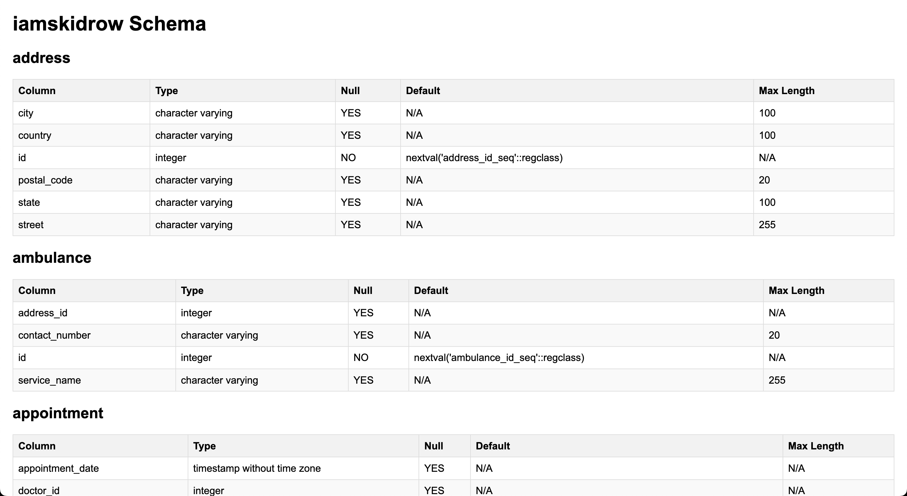

# SchemaGen

**SchemaGen** is a tool for generating and documenting PostgreSQL database schemas in HTML format.



## Usage Guide

### 1. Setup

1. **Install Dependencies:**
   Ensure you have the necessary Python libraries installed:
   ```bash
   pip3 install psycopg2

2. **Configure the Script:**
   Update the config dictionary in the script with your PostgreSQL database details:
   ```python
   config = {
    'dbname': 'your_database_name',
    'user': 'your_username',
    'password': 'your_password',
    'host': 'localhost'
   }

### 2. Run the Script

- Execute the script using Python

   ```bash
   python3 main.py

### 3. View the Output

- The script generates an HTML file named <dbname>.html (where <dbname> is your database name).
- Open the HTML file in a web browser to view the formatted database schema documentation
